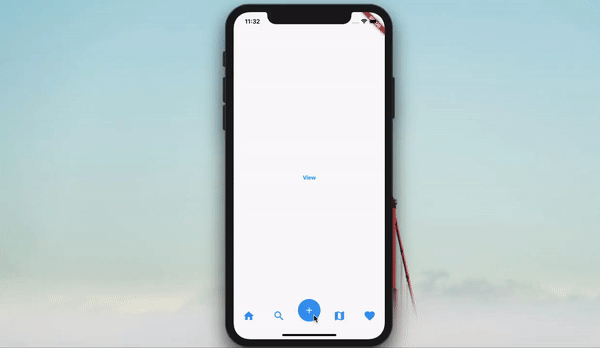

# Menu Tab Bar Flutter
Flutter component concept created with [Flutter](https://flutter.dev/) using Dart programming language, inspired by [Gooey Rab Bar](https://dribbble.com/shots/6233130-Gooey-Tab-Bar). 

## About
This component was created inspired by the GIF at the end of this page. The component is using Animations, Clip Path, Transform and Stream's with RxDart proprieties to better simulate the inspiration GIF.

### The Constructor Data Fields
````dart
final Widget child; // Hidden menu
final Color colorMenuIconDefault; // Main icon color when not pressed
final Color colorMenuIconActivated; // Main icon color when activated
final Color backgroundMenuIconDefault; // Main background icon when not pressed
final Color backgroundMenuIconActivated;// Main background icon when activated
final Color background; // Background color
final List<IconButton> iconButtons; //Tab bar icons
````
    
### The Inspiration
The GIF below shows the inspiration component.


### The App
The GIF below shows this current component running.


